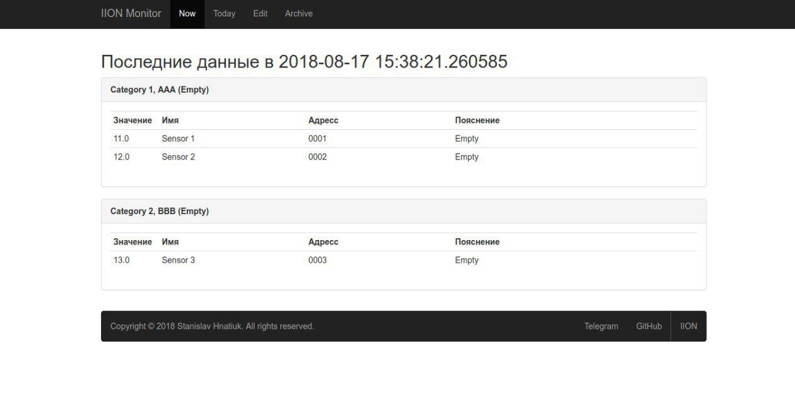
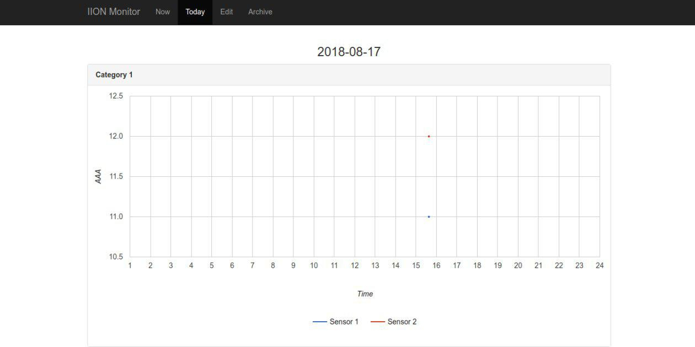
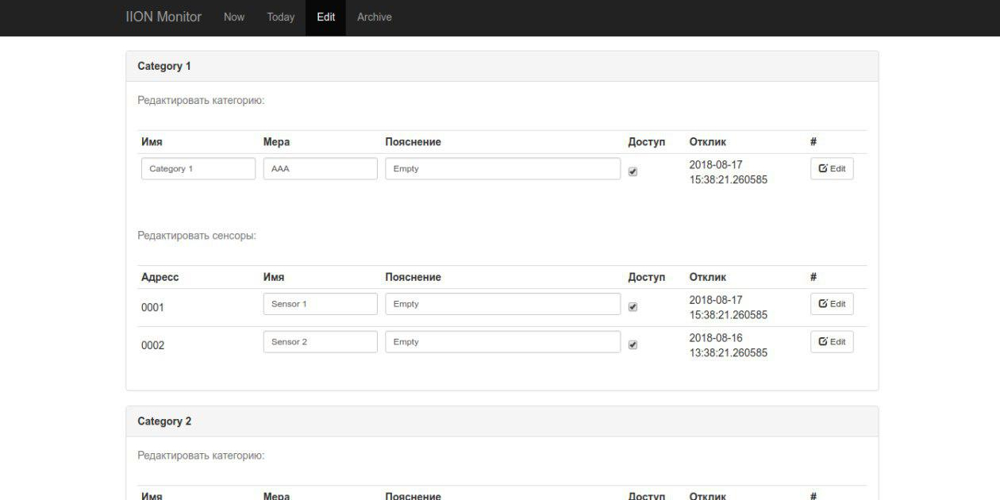

# IION-Flask-Test

## Introdution

A test project of the web server and client of the ION-Monitor system based on Flask and asyncio respectively.

## iion-monitor

This is a flask-app that provides the functions:
- display of the latest received data;
- display the graph of the data received today;
- editing parameters of sensors;
- archive of all data;
- api for receiving data.

## iion-monitor-client

This is an asynchronous application that polls the Arduino modules and writes the sensor readings to the database.

## Built with

- [Python 3.7](https://docs.python.org/3/)
- [Flask](http://flask.pocoo.org/docs/1.0/)
- [Bootstrap 3.6](https://getbootstrap.com/docs/3.3/)
- [Google Charts](https://google-developers.appspot.com/chart/interactive/docs/gallery/linechart)
- [Asyncio](https://docs.python.org/3/library/asyncio.html)
- [SqlAlchemy](https://docs.sqlalchemy.org/en/latest/)

## Screenshots

The archive display is the same as today page with the date selection.
